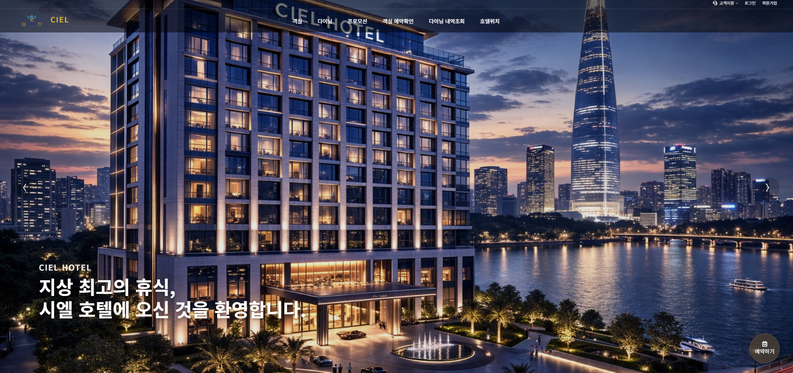

# 🏨 CIEL PMS — 호텔 예약 및 운영 관리 시스템

> **Spring Boot 기반 호텔 PMS(Project Management System)**  
> 객실 예약, 결제, 재고, 관리자 운영, 다이닝/셔틀/프로모션 서비스를 통합 관리하는 팀 프로젝트입니다.

<br>

## 📌 프로젝트 개요

| 항목 | 내용 |
|---|---|
| 진행 기간 | 2026.02.24 ~ 2026.03.31 (5주) |
| 팀 구성 | 4인 팀 프로젝트 (기여도 30%) |
| Backend | Java 17, Spring Boot 3.x, Spring Security, MyBatis |
| Frontend | Thymeleaf, JavaScript, AJAX, Bootstrap |
| Database | Oracle |
| Infra | AWS EC2, Docker, Jenkins, Nginx |
| 인증 | JWT, OAuth2 (Kakao / Naver) |
| 외부 API | PortOne(Iamport), CoolSMS |
| 기타 | Spring Scheduler, FullCalendar |

<br>

## 🔗 링크

- **PPT (코드 설명 / 시퀀스 / 다이어그램 / 트러블슈팅)**  
  https://www.canva.com/design/DAHEBLZqPS8/3rTwu_io4cPWYOjEGCKcxw/edit

- **시연 영상**  
  https://www.youtube.com/watch?v=h7kKvMWW5Cc

- **GitHub**  
  https://github.com/lhk9311/Final_hotel

- **Swagger UI**  
  http://52.78.28.91/final_hotel/swagger-ui/index.html

<br>

## 👤 담당 역할 (My Contribution)

### 🏨 객실 / 예약 도메인

| 기능 | 구현 내용 |
|---|---|
| 객실 조회 | 날짜별 재고 + 시즌/요일 가격 기반 조회 |
| 객실 상세 | 로그인 기반 최근 조회 / 추천 객실 분기 처리 |
| 객실 비교 | LocalStorage 기반 비교 기능 구현 |
| 예약 처리 | 회원 / 소셜 / 비회원(Guest) 예약 분기 |
| 재고 관리 | 날짜별 재고 테이블 설계 및 재고 차감 처리 |
| 예약 완료 | 예약 코드 생성 및 완료 페이지 구현 |
| 리마인드 메일 | Spring Scheduler 기반 체크인 전일 자동 발송 |

### 💳 결제 / 동시성 처리

| 기능 | 구현 내용 |
|---|---|
| 결제 검증 | PortOne API 기반 서버 측 결제 금액 검증 |
| 동시성 제어 | `SELECT ... FOR UPDATE` 기반 비관적 락 적용 |
| 트랜잭션 처리 | 예약 + 결제 + 재고 차감을 하나의 트랜잭션으로 처리 |
| 문자/메일 발송 | CoolSMS / JavaMailSender 연동 |

### 🔐 인증 / 보안

| 기능 | 구현 내용 |
|---|---|
| JWT 인증 | Spring Security 기반 인증 구조 |
| OAuth2 로그인 | Kakao / Naver 소셜 로그인 |
| CSRF 처리 | AJAX 요청 헤더 기반 토큰 처리 |
| 권한 분리 | 총괄 관리자 / 지점 관리자 권한 분리 |

### 🛠 관리자 기능

| 기능 | 구현 내용 |
|---|---|
| 호텔 CRUD | 호텔 등록 / 수정 / 삭제 / 원복 |
| 객실 승인 프로세스 | 객실 신청 → 승인 / 반려 흐름 설계 |
| 재고 자동 생성 | 승인 시 1년 기준 재고 자동 생성 |
| 예약 관리 | 체크인 / 체크아웃 / 검색 / 엑셀 다운로드 |
| 수익 관리 | 객실 / 다이닝 수익 통계 |

<br>

## 🔍 트러블슈팅

### 01. 객실 중복 예약(Overbooking) 문제

**문제**  
동일 객실에 대해 여러 사용자가 동시에 예약 시 재고가 음수로 감소하는 문제 발생 가능.

**해결**  
재고 조회 시 아래 구문을 사용하여 재고 Row에 비관적 락(Pessimistic Lock) 적용.

```sql
SELECT ... FOR UPDATE
```

또한:

- 예약 저장
- 결제 저장
- 재고 차감

과정을 하나의 `@Transactional` 트랜잭션으로 처리.

**결과**
- 초과 예약 방지
- 데이터 정합성 확보
- 재고 부족 시 전체 Rollback 처리

---

### 02. 결제 금액 위변조 문제

**문제**  
클라이언트 측 결제 금액 조작 가능성 존재.

**해결**  
PortOne REST API를 통해:

- `imp_uid` 기반 실제 결제 정보 조회
- 서버 계산 금액과 비교 검증

구조 적용.

**결과**
- 서버 기준 결제 검증 수행
- 위변조 결제 차단
- 데이터 무결성 확보

---

### 03. JWT 적용 후 AJAX POST 요청 차단 문제

**문제**  
JWT 전환 이후 AJAX POST 요청이 CSRF 검증 실패로 차단됨.

**해결**
- 공통 Layout 메타 태그에 CSRF 정보 저장
- fetch/ajax 헤더에 CSRF 토큰 주입

구조 적용.

**결과**
- 보안 설정 유지
- 비동기 요청 정상 처리

<br>

## 📁 프로젝트 구조 (담당 영역 중심)

```text
src/main/java/com/spring/app/

├── hk/
│
├── hk/payment/
│   └── controller/
│       └── PaymentController.java
│
├── hk/reservation/
│   ├── controller/
│   │   ├── ReservationController.java
│   │   └── ReservationExcelController.java
│   │
│   ├── service/
│   │   ├── ReservationService.java
│   │   ├── ReservationService_imple.java
│   │   ├── ReservationMailService.java
│   │   └── ReservationScheduler.java
│   │
│   ├── model/
│   │   ├── ReservationDAO.java
│   │   └── ReservationDAO_imple.java
│   │
│   ├── domain/
│   │   ├── ReservationDTO.java
│   │   ├── PaymentDTO.java
│   │   └── ViewHistoryDTO.java
│   │
│   └── mail/
│
├── hk/room/
│   ├── controller/
│   │   ├── RoomController.java
│   │   ├── RoomCompareController.java
│   │   └── RoomDetailController.java
│   │
│   ├── service/
│   │   ├── RoomTypeService.java
│   │   └── RoomStockService.java
│   │
│   ├── model/
│   │   ├── RoomTypeDAO.java
│   │   ├── RoomStockDAO.java
│   │   └── RoomImageDAO.java
│   │
│   └── domain/
│       ├── RoomDTO.java
│       ├── RoomStockDTO.java
│       └── RoomImageDTO.java
│
├── hk/admin/hotel/
│   ├── controller/
│   │   ├── AdminHotelListController.java
│   │   ├── AdminHotelRegisterController.java
│   │   ├── AdminHotelEditController.java
│   │   ├── AdminHotelDeleteController.java
│   │   └── AdminHotelRestoreController.java
│   │
│   ├── service/
│   ├── model/
│   └── domain/
│
├── hk/admin/room/
│   ├── controller/
│   │   ├── AdminRoomApprovalController.java
│   │   ├── AdminRoomRejectController.java
│   │   ├── AdminRoomRegisterController.java
│   │   └── AdminRoomStockController.java
│   │
│   ├── service/
│   ├── model/
│   └── domain/
│
├── hk/admin/reservation/
│   ├── controller/
│   │   ├── AdminReservationListController.java
│   │   ├── AdminCheckinController.java
│   │   ├── AdminCheckoutController.java
│   │   └── ReservationExcelDownloadController.java
│   │
│   ├── service/
│   ├── model/
│   └── domain/
│
├── jh/security/
│   ├── JwtAuthenticationFilter.java
│   ├── CustomOAuth2UserService.java
│   ├── SecurityConfig.java
│   └── JwtTokenProvider.java
│
└── mybatis/mapper/
    ├── hk_room_select.xml
    ├── hk_room_reservation.xml
    ├── hk_room_stock.xml
    ├── hk_admin_room.xml
    ├── hk_admin_hotel.xml
    ├── hk_admin_reservation.xml
    └── ...
```

<br>

## ⚙️ 핵심 구현 포인트

- MyBatis 기반 동적 SQL 활용
- 날짜별 재고(stock) 테이블 설계
- 시즌/요일 기반 가격 계산
- 회원 / 비회원 예약 분기
- PortOne 결제 검증
- CoolSMS 문자 발송
- Spring Scheduler 기반 리마인드 메일
- JWT + OAuth2 인증 구조
- Spring Security 기반 권한 처리
- Docker 기반 배포 환경 구축
- Jenkins 기반 CI/CD 자동화

<br>

## 🚀 배포 환경

```text
[ Client ]
     ↓
[ Nginx ]
     ↓
[ Spring Boot (Docker) ]
     ↓
[ Oracle DB ]
```

### CI/CD 흐름

```text
Local → GitHub Push
      ↓
Jenkins Build
      ↓
Docker Image Build
      ↓
Docker Hub Push
      ↓
AWS EC2 Pull & Deploy
```

<br>

## 📸 메인 화면

